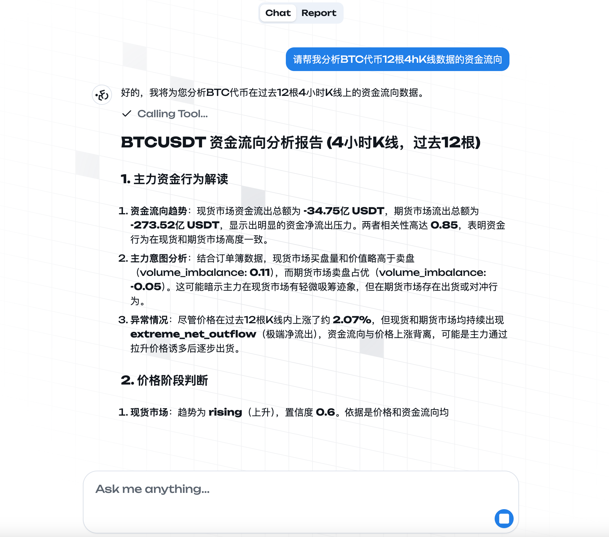
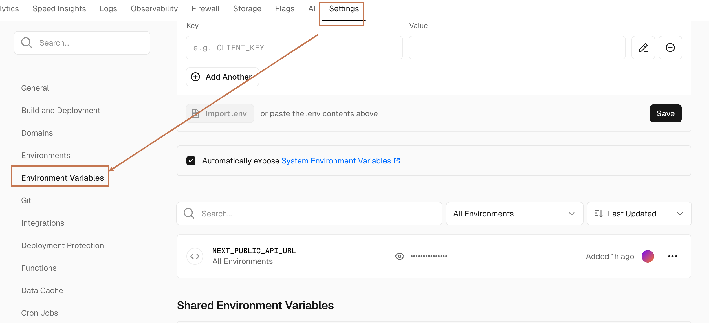

# GABRIEL Web
> 这是币安交易所数据分析AI助手 Gabriel 的 Web 端



## 后端项目地址
https://github.com/xxxijustwei/gabriel-api

## 功能

- 获取交易所代币的资金费率

    输入： `当前资金费率最高的5个代币`

- 分析代币的资金流向数据

    输入： `请帮我分析BTC代币12根4hK线数据的资金流向`

- 获取当前分析任务的配置

    输入： `帮我修改定时任务配置为“ETH代币12根4hK线数据的资金流向“`
- 设置分析任务的配置

    输入： `当前分析任务的配置是什么`

## 开始使用

### 安装

1. 克隆仓库:
    ```bash
    git clone https://github.com/xxxijustwei/gabriel-web.git
    ```

2. 安装依赖:
    ```bash
    bun install
    ```


3. 创建 `.env` 文件

   ```bash
   NEXT_PUBLIC_API_URL="" # API URL
   ```

4. 启动开发服务器:

   ```bash
   bun run dev
   ```

5. 打开浏览器并访问 `http://localhost:8080`

## 部署到 Vercel

1. 安装 Vercel CLI

   ```bash
   bun install -g vercel
   ```

2. 登录 Vercel

   ```bash
   vercel login
   ```

3. 部署到 Vercel

   ```bash
   vercel --prod
   ```

4. 在 Vercel 仪表盘中设置环境变量
   ```bash
   NEXT_PUBLIC_API_URL="" # API URL
   ```
   

5. 重新部署项目

   ```bash
   vercel --prod
   ```